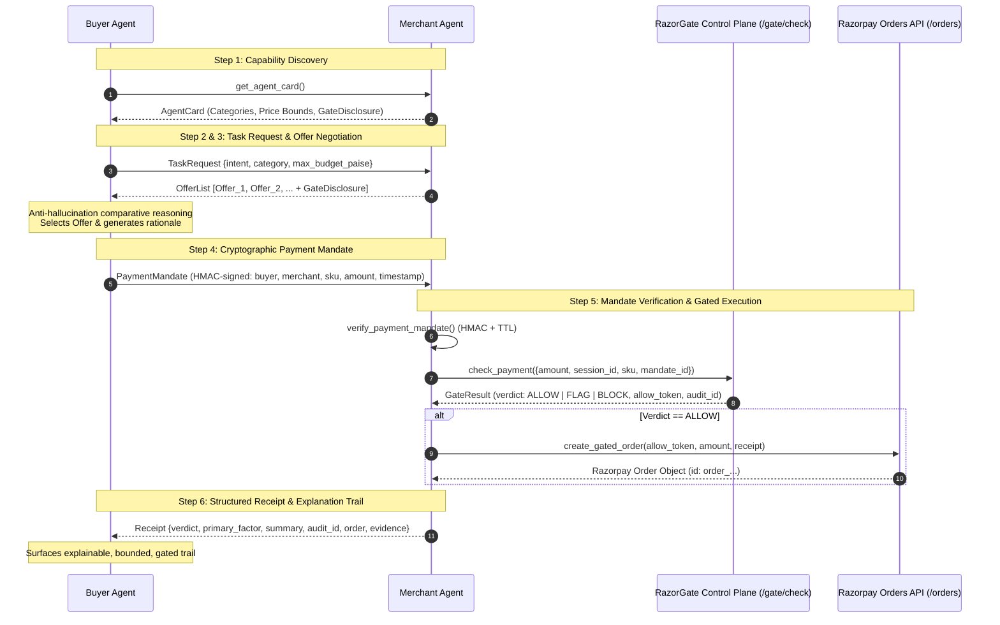

# RazorGate A2A Protocol Specification

> **Lineage & Scope Statement:**
> The **RazorGate Agent-to-Agent (A2A) Commerce Protocol** is an original, lightweight in-process protocol inspired by the emerging **AP2 / ACP / x402** pattern space (Agent Payments Protocol / Agent Commerce Protocol).
> **It is not a claim of literal compliance with Google AP2, Visa VIC, or NPCI UAP specifications.** It is a purpose-built protocol implementation demonstrating how autonomous AI buyers and merchants exchange structured capabilities, negotiate offers with comparative reasoning, issue bounded cryptographic payment mandates, and execute gated transactions with full audit traceability.

---

## Architecture Overview

In traditional agentic setups, a single agent invokes backend tools directly without negotiating terms or establishing bounded authorizations.

In the **RazorGate A2A Model**, commerce happens between two distinct agents communicating exclusively via structured protocol messages:
1. **Buyer Agent (`buyer_agent.py`)**: Represents the purchaser with an intent, budget ceiling, and private signing key. Performs genuine comparative reasoning and issues cryptographically signed, single-transaction payment mandates.
2. **Merchant Agent (`merchant_agent.py`)**: Fronts the merchant's catalog, RazorGate deterministic gate engine (`/gate/check`), and Razorpay Orders API (`/orders`). Advertises explicit security gating capabilities and executes gated orders on the buyer's behalf.



---

## 6-Step Protocol Lifecycle

### 1. Capability Discovery (`AgentCard`)
The Merchant Agent exposes an agent-readable capability card. Unlike closed APIs, the merchant advertises its security contract as a first-class feature:
- **`gate_disclosure`**: Explicitly states that every transaction is subject to real-time deterministic security gating (`ALLOW` / `FLAG` / `BLOCK`) and ceiling limits.

```json
{
  "merchant_id": "merchant_razorgate_cloud",
  "merchant_name": "RazorGate Cloud & AI Compute Services",
  "protocol_version": "razorgate-a2a-v1",
  "categories": ["ai_compute", "api_credits", "cloud_infra", "enterprise_services"],
  "price_range_paise": { "min": 4900, "max": 6500000 },
  "supported_currencies": ["INR"],
  "gate_disclosure": {
    "gating_enforced": true,
    "gating_policy": "RazorGate Deterministic Policy v1.0",
    "contract": "All transactions are evaluated in real-time by RazorGate deterministic security policies; subject to ALLOW/FLAG/BLOCK gating before payment execution.",
    "supported_verdicts": ["ALLOW", "FLAG", "BLOCK"],
    "max_order_ceiling_inr": 50000.0
  }
}
```

### 2. Task Request (`TaskRequest`)
The Buyer Agent sends a typed task request rather than unstructured chat text:
```json
{
  "request_id": "req_1724749200000",
  "buyer_agent_id": "buyer_agent_alpha",
  "intent": "GPU compute for model inference",
  "category": "ai_compute",
  "max_budget_paise": 50000,
  "currency": "INR"
}
```

### 3. Offer Negotiation & Comparative Reasoning (`OfferList`)
The Merchant returns 2–4 ranked offers from its inventory with attached gate disclosures:
```json
{
  "request_id": "req_1724749200000",
  "merchant_id": "merchant_razorgate_cloud",
  "offers": [
    {
      "sku": "compute-gpu-h100-1hr",
      "name": "NVIDIA H100 SXM 80GB Instance (1 Hour)",
      "amount_paise": 29900,
      "gate_disclosure": "Subject to real-time risk gating; may result in ALLOW/FLAG/BLOCK before execution."
    },
    {
      "sku": "compute-gpu-a100-1hr",
      "name": "NVIDIA A100 Tensor Core 40GB Instance (1 Hour)",
      "amount_paise": 14900,
      "gate_disclosure": "Subject to real-time risk gating; may result in ALLOW/FLAG/BLOCK before execution."
    }
  ]
}
```
**Anti-Hallucination Comparative Reasoning Constraint:**
The Buyer Agent evaluates the offers and formulates an explicit rationale that references *only* the SKUs, specifications, and prices actually returned by the Merchant.

### 4. Bounded Payment Mandate (`PaymentMandate`)
Analogous to AP2's mandate concept, the Buyer Agent signs a bounded authorization:
- It authorizes **only** the selected SKU, the exact amount, and the recipient merchant.
- Secured via cryptographic HMAC-SHA256 signature with timestamp TTL.

```json
{
  "mandate_id": "mnd_1724749205000",
  "buyer_agent_id": "buyer_agent_alpha",
  "merchant_id": "merchant_razorgate_cloud",
  "sku": "compute-gpu-a100-1hr",
  "amount_paise": 14900,
  "currency": "INR",
  "timestamp": 1724749205.0,
  "reasoning": "Selected compute-gpu-a100-1hr (₹149.00) matching inference throughput requirements over compute-gpu-h100-1hr (₹299.00).",
  "signature": "c85d7bf192f58e1378...0f81"
}
```

### 5. Gated Execution (Fronting RazorGate & Razorpay)
1. **Mandate Verification**: Merchant Agent verifies the cryptographic HMAC signature. Tampered mandates (altered SKU, altered amount) are blocked immediately before reaching the gate or payments backend.
2. **Gate Evaluation**: Merchant submits the payment check to RazorGate's `/gate/check` pipeline (Apiris intelligence + Behavioral drift + Payments policy).
3. **Execution on ALLOW**: If approved, RazorGate mints a short-lived (~30s TTL) server-signed `allow_token`. The Merchant calls Razorpay `/orders` with this token to create the real test-mode order.
4. **Audit Linkage**: RazorGate links the resulting Razorpay Order ID (`order_...`) to the SQLite audit ledger record.

### 6. Structured Receipt (`Receipt`)
The Merchant Agent returns a full receipt containing the verdict, primary factor, human-readable summary, audit record, and the real Razorpay order:

```json
{
  "receipt_id": "rcpt_a2a_1724749210000",
  "mandate_id": "mnd_1724749205000",
  "buyer_agent_id": "buyer_agent_alpha",
  "merchant_id": "merchant_razorgate_cloud",
  "sku": "compute-gpu-a100-1hr",
  "amount_paise": 14900,
  "amount_inr": 149.00,
  "currency": "INR",
  "verdict": "ALLOW",
  "primary_factor": "policy_cleared",
  "summary": "₹149.00 APPROVED: All safety, risk, and policy checks cleared successfully.",
  "confidence": 1.0,
  "audit_id": 42,
  "order": {
    "id": "order_Qz8R49a1Xy",
    "entity": "order",
    "amount": 14900,
    "currency": "INR",
    "status": "created"
  }
}
```

---

## Core Security Invariants

1. **Bounded Authorization**: The Buyer Agent cannot be charged more than the signed mandate amount, nor for a different SKU.
2. **Replay & Tampering Defense**: Modifying mandate fields invalidates the HMAC signature immediately at the Merchant boundary.
3. **No Direct Payment Access for Buyer**: Buyer Agents never hold Razorpay API credentials or direct access to payment endpoints.
4. **Deterministic Policy Enforcement**: Regardless of LLM reasoning or mandate validity, the RazorGate gate layer strictly blocks transactions exceeding policy ceilings (e.g. ₹50,000 ceiling).
5. **Full Forward & Backward Traceability**: Every protocol receipt links directly to an immutable audit record and an upstream Razorpay Order ID.
